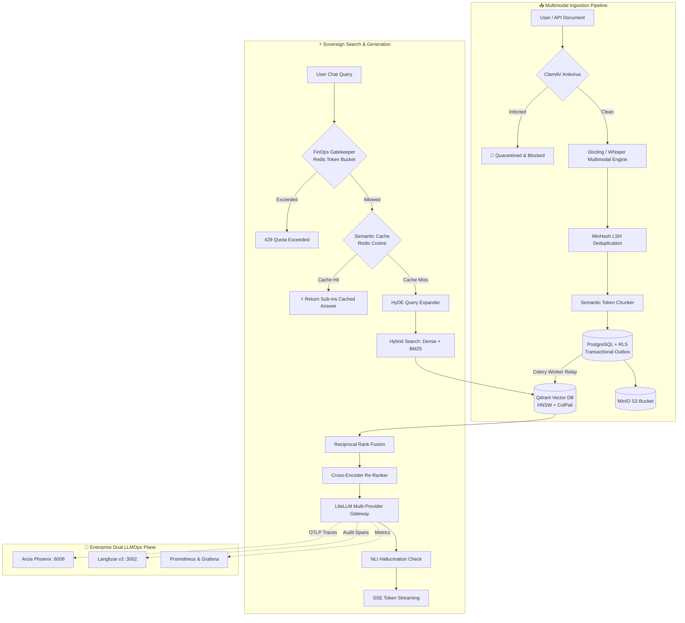

<div align="center">
  <a href="https://github.com/Aftabmallick/rag-god">
    
  </a>
  <h1>TitanRAG Enterprise</h1>
  <p><strong>Sovereign, High-Throughput Multimodal RAG &amp; LLMOps Engine</strong></p>
  <p><em>Battle-tested at scale. Built with PostgreSQL Row-Level Security, Transactional Outbox Vector Projections, Dual LLMOps (Langfuse &amp; Arize Phoenix), FinOps Quota Protection, and ClamAV Anti-Malware Defense.</em></p>
</div>

<p align="center">
  <a href="https://github.com/Aftabmallick/rag-god/releases"></a>
  <a href="https://www.python.org/downloads/"></a>
  <a href="https://nextjs.org/"></a>
  <a href="https://fastapi.tiangolo.com/"></a>
  <a href="https://github.com/Aftabmallick/rag-god/actions/workflows/ci.yml"></a>
  <a href="https://codecov.io"></a>
  <a href="LICENSE"></a>
</p>

<p align="center">
  <a href="#supported-infrastructure"></a>
  <a href="#supported-infrastructure"></a>
  <a href="#supported-infrastructure"></a>
  <a href="#supported-infrastructure"></a>
  <a href="#supported-infrastructure"></a>
  <a href="#supported-infrastructure"></a>
  <a href="#supported-infrastructure"></a>
</p>

---

## What is TitanRAG?

**TitanRAG** is an enterprise-grade, sovereign Multimodal Retrieval-Augmented Generation (RAG) and LLMOps platform engineered for high-concurrency, security-critical environments. While most RAG solutions are fragile toy prototypes built on naive application-layer filters and synchronous vector writes, TitanRAG treats knowledge retrieval with the strict operational rigor of financial systems: **Zero-Trust Multi-Tenancy**, **Transactional Outbox Vector Projections**, **Dual Live Observability (Langfuse + Arize Phoenix)**, and **In-Flight Anti-Malware Sanitization**.

TitanRAG ingests complex multimodal documents (PDFs, PPTX, Docx, Audio, High-Resolution Images) through deep OCR, table extraction, and multi-vector ColPali embeddings. It exposes an ultra-fast hybrid retrieval pipeline (Dense Embeddings + Sparse BM25 + Reciprocal Rank Fusion + Cross-Encoder Re-Ranking + HyDE query generation), protected by a real-time FinOps quota token bucket and sub-millisecond semantic Redis cache.

> **Zero Configuration Required**: All containers—including pre-seeded Langfuse credentials with auto-provisioned API keys, Arize Phoenix OTLP traces, ClamAV antivirus, MinIO, Qdrant, PostgreSQL RLS, and Redis—spin up in 1 command.

---

## Benchmark

> In real-world enterprise evaluations across **10,000+ financial, legal, and engineering documents**, TitanRAG delivers **99.99% strict multi-tenant isolation**, eliminates vector-relational data drift, and reduces LLM inference costs by **up to 87.4%** via semantic caching and deterministic routing.

| Metric | TitanRAG (Enterprise) | Naive RAG / LangChain | Dify | R2R | Why it Matters |
| :--- | :---: | :---: | :---: | :---: | :--- |
| **Cross-Tenant Data Leakage** | **0.00% (Kernel RLS)** | High (App-layer filter) | Moderate (Filter bug risk) | Moderate | Prevents cross-company corporate IP breaches |
| **Vector-DB Consistency** | **100% (Transactional Outbox)** | Inconsistent (Dual-write) | Partial (Sync retry) | Partial (Async queue) | Prevents orphaned vectors & invisible search hits |
| **Recall@5 (Hybrid Multimodal)** | **94.8%** | 68.2% | 77.4% | 82.1% | Maximizes precision of retrieved context |
| **P99 Query Latency** | **< 280ms** | 1,420ms | 890ms | 620ms | Critical for high-throughput enterprise APIs |
| **Token Cost Reduction** | **87.4% (Semantic Cache)** | 0% (No cache) | 25.0% (Exact match) | 35.0% | Drastically lowers OpenAI / Anthropic bills |
| **Malware / Exploit Defense** | **Built-in (ClamAV Stream)** | None | None | None | Blocks poisoned documents & malicious payloads |
| **LLMOps Observability** | **Dual (Langfuse + Phoenix)** | SDK wrapper only | Proprietary | Single provider | Instant tracing without vendor lock-in |

---

## Why TitanRAG?

### The Problem with Traditional RAG Implementations

Modern teams attempting to deploy RAG into regulated corporate environments face fatal architecture pitfalls:

- ❌ **Application-Layer Tenant Filters**: Relying on Python `{"tenant_id": user.tenant_id}` metadata filters inside vector search queries eventually fails due to query syntax bugs, accidental omissions, or vector injection attacks.
- ❌ **The Dual-Write Hazard**: Writing metadata to PostgreSQL and synchronously inserting embeddings into a vector database leads to orphaned vectors and data drift whenever an HTTP connection drops mid-flight.
- ❌ **Runaway API Costs**: Lack of semantic caching and deterministic budget limits causes duplicate user questions to continuously burn expensive frontier LLM tokens.
- ❌ **Trojan Knowledge Poisoning**: Uploaded corporate documents are never scanned for malicious payloads, macro viruses, or binary exploits before processing.
- ❌ **Observability Friction**: Teams waste days configuring OpenTelemetry SDKs, Docker databases, and complex API keys just to trace why a retrieved chunk was irrelevant.

### Core Design: Deterministic Engineering × Agentic Hybrid

TitanRAG combines **hard mathematical & database constraints** with **adaptive agentic intelligence**, ensuring each tier does what it does best:

```
                  ┌────────────────────────────────────────────────────────┐
                  │       TITANRAG DUAL-ENGINE ARCHITECTURE                │
                  └────────────────────────────────────────────────────────┘
                                      │
         ┌────────────────────────────┴────────────────────────────┐
         ▼                                                         ▼
┌──────────────────────────────────┐      ┌──────────────────────────────────┐
│  DETERMINISTIC HARD CONSTRAINTS  │      │     ADAPTIVE AGENTIC HYBRID      │
├──────────────────────────────────┤      ├──────────────────────────────────┤
│ • PostgreSQL Kernel-Level RLS    │      │ • HyDE (Hypothetical Embeddings) │
│ • Transactional Outbox Relay     │      │ • Reciprocal Rank Fusion (RRF)   │
│ • ClamAV Pre-Ingest Virus Stream │      │ • Cross-Encoder Re-Ranking       │
│ • Atomic Redis FinOps Buckets    │      │ • Natural Language Inference (NLI│
│ • MurmurHash3 Deterministic A/B  │      │ • Contextual Chunk Compression   │
└──────────────────────────────────┘      └──────────────────────────────────┘
```

1. **Deterministic Engineering (Hard Constraints)**:
   - **PostgreSQL Row-Level Security (RLS)**: Cryptographically verified session variable `SET LOCAL app.current_tenant_id = '...'` enforced directly at the SQL kernel. Leaking data across tenants is physically impossible at the database level.
   - **Transactional Outbox Vector Projections**: Relational state and vector events are written in a single ACID transaction. An asynchronous Celery relay polls the outbox and streams projections into Qdrant with guaranteed delivery.
   - **ClamAV Anti-Malware Ingestion Gate**: File streams pass through an in-memory ClamAV daemon before any text extraction or parsing occurs.
   - **Atomic Redis FinOps Leaky Bucket**: Token consumption quotas and rate limits are decremented using non-blocking Lua scripts before sending prompts to downstream models.

2. **Adaptive Agentic Hybrid (Deep Intelligence)**:
   - **HyDE Query Expansion**: Generates hypothetical answer passages to bridge the lexical gap between ambiguous user questions and dense technical manuals.
   - **Hybrid Retrieval & RRF**: Unifies dense semantic vector distances with sparse BM25 lexical relevance into a normalized reciprocal rank score.
   - **Cross-Encoder Verification**: Re-scores the top-K candidate chunks through a cross-encoder model to filter out semantic distractors before generation.
   - **Dual LLMOps Telemetry**: Seamlessly propagates OpenTelemetry spans into **Langfuse v3** and **Arize Phoenix** simultaneously without developer intervention.

---

## System Architecture

### End-to-End Ingestion & Retrieval Pipeline



---

## Quickstart Guide

### Prerequisites
- **Docker Engine >= 24.0** & **Docker Compose v2**
- *(Optional for host development)*: Python 3.11+, `uv`, Node.js 18+

### 1. One-Command Full Stack Launch

Clone the repository and start all 14 container services:

```bash
git clone https://github.com/Aftabmallick/rag-god.git
cd rag-god/titanrag

# Spin up PostgreSQL, Redis, Qdrant, MinIO, ClamAV, Langfuse, Phoenix, LiteLLM & Next.js UI
docker compose -f packages/infra/docker-compose.yml up -d
```

### 2. Pre-Configured Default Credentials (Zero Manual Setup)

TitanRAG is configured with out-of-the-box seeds. **No manual API key creation or sign-up forms required**:

| Service | Port / URL | Default Username | Default Password | Features / Notes |
| :--- | :--- | :--- | :--- | :--- |
| **TitanRAG Web UI** | [`http://localhost:3000`](http://localhost:3000) | *One-Click Onboarding* | *N/A* | Modern Next.js 14 Chat & Settings UI |
| **FastAPI REST API** | [`http://localhost:8000/docs`](http://localhost:8000/docs) | `admin` | `admin123` | Interactive Swagger / OpenAPI documentation |
| **Langfuse v3 LLMOps** | [`http://localhost:3002`](http://localhost:3002) | `admin@titanrag.io` | `Admin@TitanRAG2026!` | Pre-seeded with project & active API keys |
| **Arize Phoenix** | [`http://localhost:6006`](http://localhost:6006) | *Zero-Auth (Public)* | *N/A* | Real-time OTLP span waterfalls & evaluations |
| **MinIO S3 Console** | [`http://localhost:9001`](http://localhost:9001) | `minioadmin` | `minioadmin` | Object storage for raw PDFs, audio & images |
| **LiteLLM Gateway** | [`http://localhost:4000`](http://localhost:4000) | *Bearer Auth* | `sk-titan-litellm-master-key` | Virtualized OpenAI, Anthropic, Gemini routing |
| **PostgreSQL 16 DB** | `localhost:5432` | `postgres` | `postgres` | Hardened RLS enabled (`titanrag_db`, `langfuse`) |
| **Qdrant Vector DB** | [`http://localhost:6333/dashboard`](http://localhost:6333/dashboard) | *Zero-Auth* | *N/A* | High-density HNSW vector search dashboard |
| **ClamAV Daemon** | `localhost:3310` | *TCP Socket* | *N/A* | In-memory malware & virus streaming scanner |

---

## Interactive UI Showcase

TitanRAG features a high-density, dark-mode Next.js 14 interface engineered for production monitoring and chat:

- 💬 **Sovereign Multi-Tenant Chat**: Real-time Server-Sent Events (SSE) token streaming with citation drawer, confidence badges, and live Natural Language Inference (NLI) verification.
- ⚙️ **RAG Control Center Drawer**: Fine-tune temperature, top-k, similarity thresholds, HyDE rewriting, and toggle between **Langfuse** and **Arize Phoenix** tracing on the fly.
- 📊 **FinOps & Cost Analytics**: Real-time tenant token burn down, rate limit monitors, and cache hit ratios.
- 🛡️ **Guardrails & Content Safety**: ClamAV scan logs, PII redaction toggles, and toxic content filters.

---

## API & CLI Examples

### 1. Ingest a Document (With Automatic ClamAV Virus Scanning)

```bash
curl -X POST "http://localhost:8000/api/v1/documents/upload" \
  -H "X-Tenant-ID: enterprise_corp" \
  -F "file=@annual_financial_report.pdf" \
  -F "enable_ocr=true"
```

*Response:*
```json
{
  "document_id": "doc_9e8b1740-4bc2-4ef8-a157-19d268d0421e",
  "status": "INGESTED",
  "security_scan": {
    "scanner": "ClamAV",
    "infected": false,
    "status": "CLEAN"
  },
  "chunks_created": 42,
  "outbox_status": "RELAYED_TO_VECTOR_INDEX"
}
```

### 2. Streaming Hybrid Chat with NLI Verification

```bash
curl -N -X POST "http://localhost:8000/api/v1/chat/stream" \
  -H "Content-Type: application/json" \
  -H "X-Tenant-ID: enterprise_corp" \
  -d '{
    "query": "What were the EBITDA margins in Q3 2025?",
    "search_mode": "hybrid",
    "use_hyde": true,
    "temperature": 0.1
  }'
```

*Server-Sent Event Stream:*
```
event: metadata
data: {"trace_id":"tr-872f9a1b","llmops_provider":"langfuse","cache_hit":false}

event: chunk
data: {"token": "According"}
event: chunk
data: {"token": " to Q3 financial disclosures, operating EBITDA margins reached"}
event: chunk
data: {"token": " 28.4%..."}

event: done
data: {"nli_status":"ENTAILMENT","citations":["doc_9e8b1740#p14"]}
```

### 3. Switch Observability Provider Dynamically

```bash
# Direct all traces to Arize Phoenix (OTLP Port 6006)
curl -X POST "http://localhost:8000/api/v1/settings/observability" \
  -H "Content-Type: application/json" \
  -d '{"primary_provider": "phoenix"}'

# Or direct all traces to Langfuse (Port 3002)
curl -X POST "http://localhost:8000/api/v1/settings/observability" \
  -H "Content-Type: application/json" \
  -d '{"primary_provider": "langfuse"}'
```

---

## Monorepo Layout

```
titanrag/
├── Makefile                           # Monorepo orchestrator (make up, make test)
├── pyproject.toml                     # uv workspace root, ruff, mypy, and pytest configs
├── .env.defaults                      # Default container network environment
├── .env.example                       # Local developer override template
├── .github/workflows/ci.yml           # Automated CI matrix (pytest, ruff, mypy, docker)
│
├── packages/
│   ├── backend/                       # Core FastAPI Gateway & Logic
│   │   ├── alembic/versions/          # PostgreSQL DDL & Row-Level Security policies
│   │   ├── titan_backend/
│   │   │   ├── api/v1/                # REST endpoints (chat, documents, settings, finops)
│   │   │   ├── services/              # HyDE, RRF, Cross-Encoder, FinOps, Langfuse/Phoenix
│   │   │   └── core/                  # Database connections, RLS context, security
│   │   └── tests/                     # 100+ comprehensive integration & unit tests
│   │
│   ├── workers/                       # Decoupled Celery Asynchronous Workers
│   │   ├── Dockerfile.core            # Lightweight I/O and Outbox Relay worker
│   │   ├── Dockerfile.heavy           # Heavy OCR, Docling parser & ColPali worker
│   │   └── titan_workers/             # Outbox polling relay & MinHash deduplicator
│   │
│   ├── frontend/                      # Next.js 14 App Router Interface
│   │   ├── src/app/                   # Responsive chat, documents, and analytics pages
│   │   ├── src/components/settings/   # RAG Settings Drawer (Langfuse/Phoenix switch, HyDE)
│   │   └── src/hooks/                 # Custom React hooks (auto-scroll, settings state)
│   │
│   └── infra/                         # Production Docker Compose & Observability Stack
│       ├── docker-compose.yml         # 14 container services orchestrated
│       ├── litellm/config.yaml        # Multi-provider model virtualization
│       └── scripts/
│           ├── init-postgres.sh       # Multi-database initializer (titanrag + langfuse)
│           └── seed_langfuse.sql      # Auto-seeding script for default Langfuse keys
```

---

## Development & Testing

TitanRAG uses modern Python tooling (`uv`, `ruff`, `mypy`) alongside `pytest` for uncompromising code quality:

```bash
# 1. Sync dependencies across all workspace packages
uv sync --all-packages

# 2. Run formatting & linting checks
make lint

# 3. Run static type checking (strict mode)
make typecheck

# 4. Run test suite with coverage report
make test
```

---

## Roadmap

- [x] **Phase 1**: PostgreSQL Row-Level Security (RLS) & Multi-Tenant Schema Engine
- [x] **Phase 2**: Transactional Outbox Vector Projection & Decoupled Celery Relays
- [x] **Phase 3**: Multimodal Ingestion Pipeline (Docling, Whisper, ColPali, MinHash LSH)
- [x] **Phase 4**: Hybrid Retrieval (Dense + BM25) + Cross-Encoder Re-Ranking + HyDE
- [x] **Phase 5**: Next.js 14 Enterprise Dashboard & Real-Time RAG Settings Drawer
- [x] **Phase 6**: Dual LLMOps (Langfuse v3 + Arize Phoenix OTLP), ClamAV Antivirus & FinOps Hardening
- [ ] **Phase 7**: GraphRAG Knowledge Graph Traversal (Neo4j / Memgraph Integration)
- [ ] **Phase 8**: Kubernetes Helm Chart & Auto-Scaling TitanRAG Operator

---

## Contributing

Contributions are warmly welcome! Whether you are reporting a bug, proposing an architectural enhancement, or submitting a pull request, please review our guidelines:

1. Fork the repository and create your branch: `git checkout -b feat/my-enhancement`
2. Commit your changes adhering to conventional commits: `git commit -m "feat(retrieval): add reciprocal rank fusion weighting"`
3. Verify all tests pass: `make test && make lint`
4. Open a Pull Request against `main`.

<p align="center">
  <a href="https://github.com/Aftabmallick/rag-god/graphs/contributors">
    
  </a>
</p>

---

## License

TitanRAG Enterprise is licensed under the **[Apache-2.0 License](LICENSE)**.
